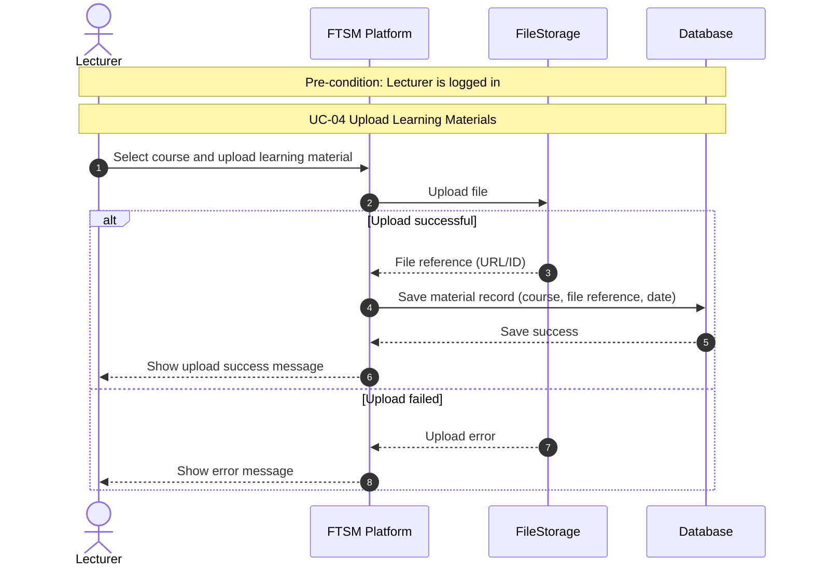

```mermaid
sequenceDiagram
autonumber
actor Lecturer
participant System as FTSM Platform
participant Storage as FileStorage
participant DB as Database

Note over Lecturer,DB: Pre-condition: Lecturer is logged in
Note over Lecturer,DB: UC-04 Upload Learning Materials

Lecturer->>System: Select course and upload learning material
System->>Storage: Upload file

alt Upload successful
Storage-->>System: File reference (URL/ID)
System->>DB: Save material record (course, file reference, date)
DB-->>System: Save success
System-->>Lecturer: Show upload success message
else Upload failed
Storage-->>System: Upload error
System-->>Lecturer: Show error message
end

```