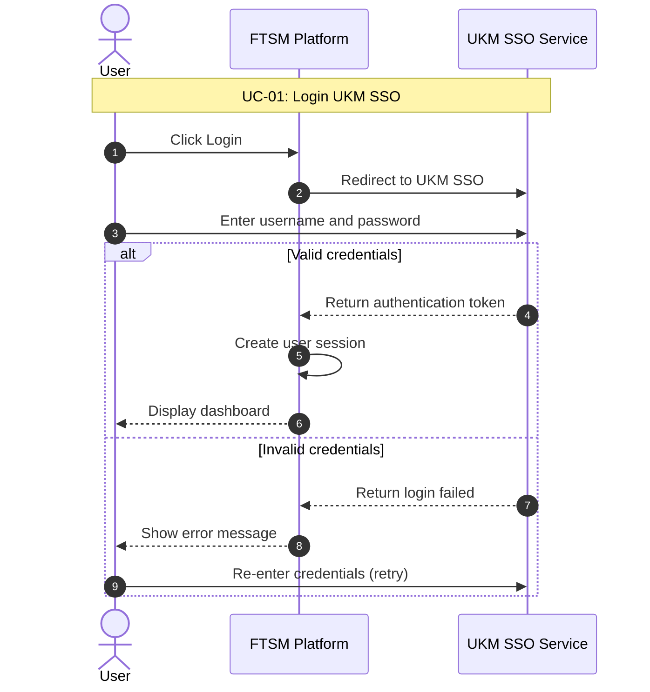

```mermaid
sequenceDiagram
autonumber
actor User
participant System as FTSM Platform
participant SSO as UKM SSO Service

Note over User,SSO: UC-01: Login UKM SSO
User->>System: Click Login
System->>SSO: Redirect to UKM SSO
User->>SSO: Enter username and password

alt Valid credentials
SSO-->>System: Return authentication token
System->>System: Create user session
System-->>User: Display dashboard
else Invalid credentials
SSO-->>System: Return login failed
System-->>User: Show error message
User->>SSO: Re-enter credentials (retry)
end

```