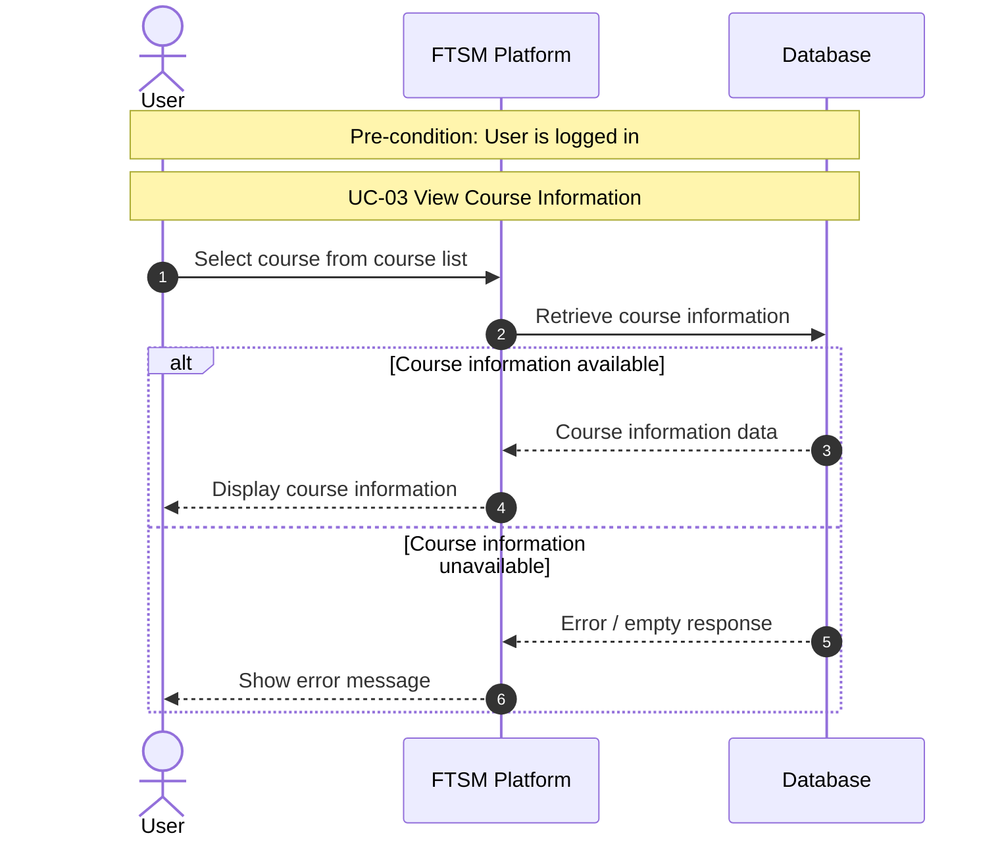

```mermaid
sequenceDiagram
autonumber
actor User
participant System as FTSM Platform
participant DB as Database

Note over User,DB: Pre-condition: User is logged in
Note over User,DB: UC-03 View Course Information

User->>System: Select course from course list
System->>DB: Retrieve course information

alt Course information available
DB-->>System: Course information data
System-->>User: Display course information
else Course information unavailable
DB-->>System: Error / empty response
System-->>User: Show error message
end

```