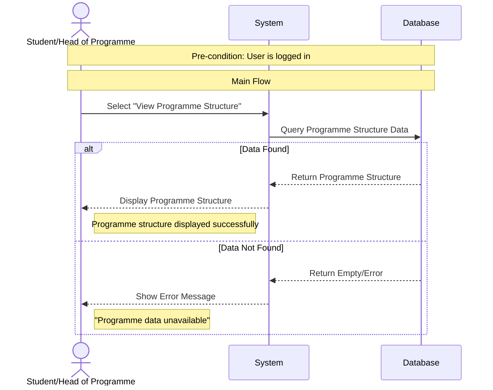

```mermaid
sequenceDiagram
    actor User as Student/Head of Programme
    participant System
    participant DB as Database

    Note over User,DB: Pre-condition: User is logged in
    Note over User,DB: Main Flow
    User->>System: Select "View Programme Structure"
    System->>DB: Query Programme Structure Data
    alt Data Found
        DB-->>System: Return Programme Structure
        System-->>User: Display Programme Structure
        Note right of User: Programme structure displayed successfully
    else Data Not Found
        DB-->>System: Return Empty/Error
        System-->>User: Show Error Message
        Note right of User: "Programme data unavailable"
    end
```