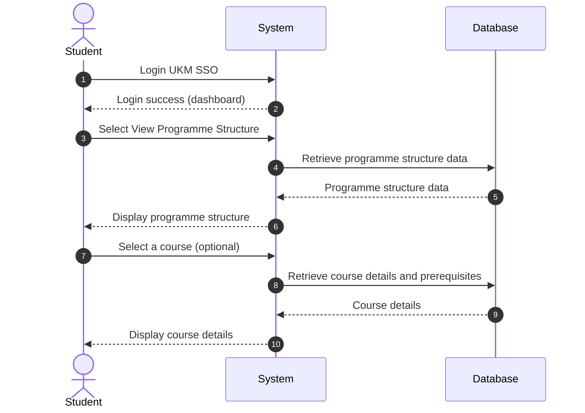

```mermaid
sequenceDiagram
autonumber
actor Student
participant System
participant DB as Database

Student->>System: Login UKM SSO
System-->>Student: Login success (dashboard)

Student->>System: Select View Programme Structure
System->>DB: Retrieve programme structure data
DB-->>System: Programme structure data
System-->>Student: Display programme structure

Student->>System: Select a course (optional)
System->>DB: Retrieve course details and prerequisites
DB-->>System: Course details
System-->>Student: Display course details

```