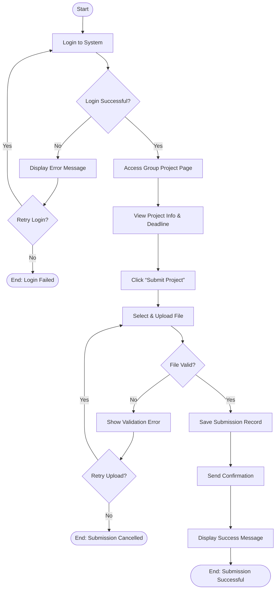

```mermaid
flowchart TD
    A([Start]) --> B[Login to System]
    B --> C{Login Successful?}
    C -- No --> D[Display Error Message]
    D --> E{Retry Login?}
    E -- Yes --> B
    E -- No --> F([End: Login Failed])
    
    C -- Yes --> G[Access Group Project Page]
    G --> H[View Project Info & Deadline]
    H --> I[Click “Submit Project”]
    I --> J[Select & Upload File]
    J --> K{File Valid?}
    
    K -- No --> L[Show Validation Error]
    L --> M{Retry Upload?}
    M -- Yes --> J
    M -- No --> N([End: Submission Cancelled])
    
    K -- Yes --> O[Save Submission Record]
    O --> P[Send Confirmation]
    P --> Q[Display Success Message]
    Q --> R([End: Submission Successful])
```