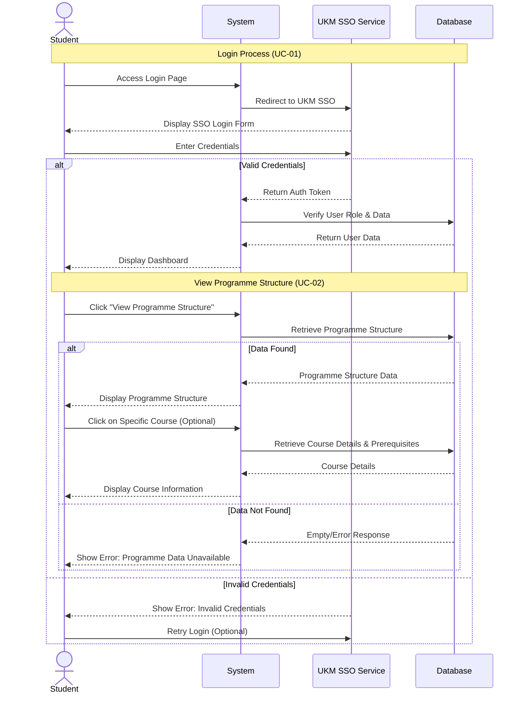

```mermaid
sequenceDiagram
    actor Student
    participant System
    participant SSO as UKM SSO Service
    participant DB as Database

    Note over Student,DB: Login Process (UC-01)
    Student->>System: Access Login Page
    System->>SSO: Redirect to UKM SSO
    SSO-->>Student: Display SSO Login Form
    Student->>SSO: Enter Credentials
    
    alt Valid Credentials
        SSO-->>System: Return Auth Token
        System->>DB: Verify User Role & Data
        DB-->>System: Return User Data
        System-->>Student: Display Dashboard
        Note over Student,DB: View Programme Structure (UC-02)
        Student->>System: Click "View Programme Structure"
        System->>DB: Retrieve Programme Structure
        alt Data Found
            DB-->>System: Programme Structure Data
            System-->>Student: Display Programme Structure
            Student->>System: Click on Specific Course (Optional)
            System->>DB: Retrieve Course Details & Prerequisites
            DB-->>System: Course Details
            System-->>Student: Display Course Information
        else Data Not Found
            DB-->>System: Empty/Error Response
            System-->>Student: Show Error: Programme Data Unavailable
        end
    else Invalid Credentials
        SSO-->>Student: Show Error: Invalid Credentials
        Student->>SSO: Retry Login (Optional)
    end
```