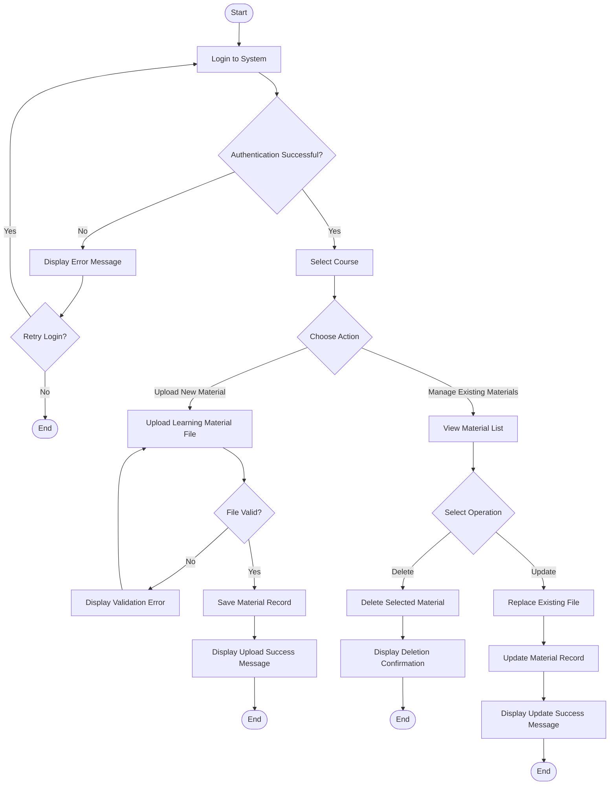

```mermaid
flowchart TD
    A([Start]) --> B[Login to System]
    B --> C{Authentication Successful?}

    C -- No --> D[Display Error Message]
    D --> E{Retry Login?}
    E -- Yes --> B
    E -- No --> F([End])

    C -- Yes --> G[Select Course]
    G --> H{Choose Action}

    H -- Upload New Material --> I[Upload Learning Material File]
    I --> J{File Valid?}
    J -- No --> K[Display Validation Error]
    K --> I
    J -- Yes --> L[Save Material Record]
    L --> M[Display Upload Success Message]
    M --> N([End])

    H -- Manage Existing Materials --> O[View Material List]
    O --> P{Select Operation}

    P -- Delete --> Q[Delete Selected Material]
    Q --> R[Display Deletion Confirmation]
    R --> S([End])

    P -- Update --> T[Replace Existing File]
    T --> U[Update Material Record]
    U --> V[Display Update Success Message]
    V --> W([End])

```