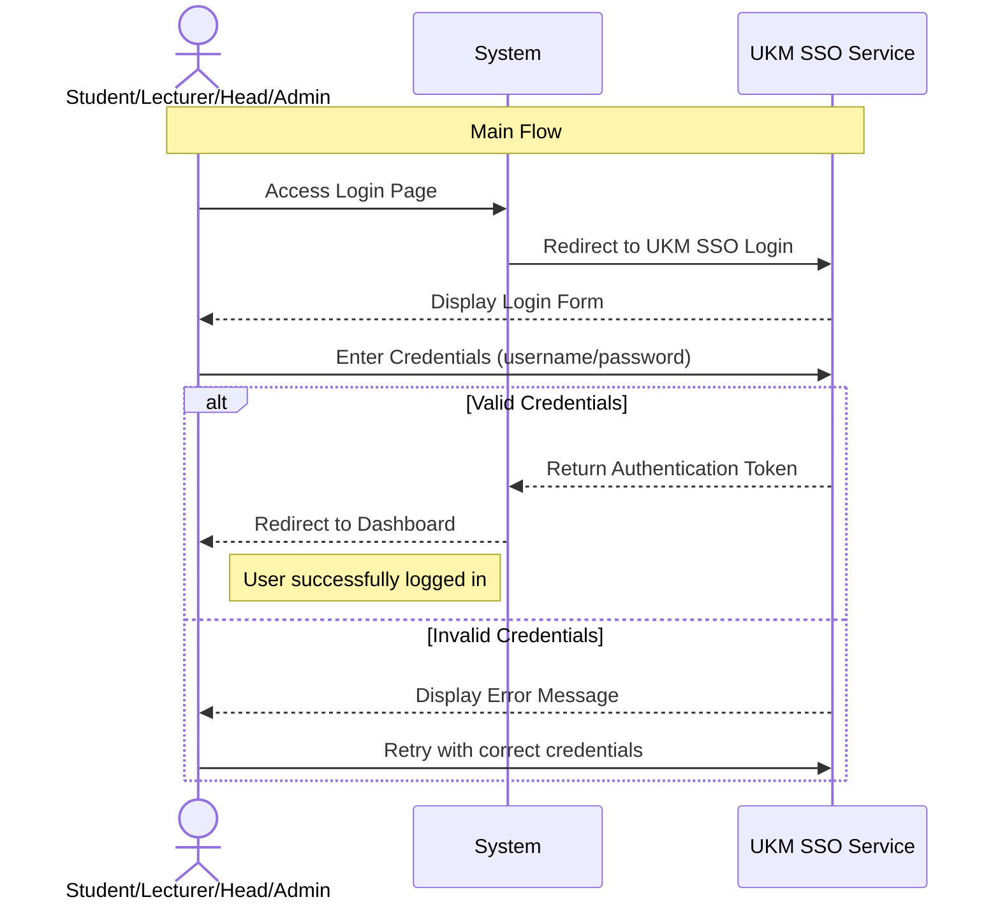

```mermaid
sequenceDiagram
    actor User as Student/Lecturer/Head/Admin
    participant System
    participant SSO as UKM SSO Service

    Note over User,SSO: Main Flow
    User->>System: Access Login Page
    System->>SSO: Redirect to UKM SSO Login
    SSO-->>User: Display Login Form
    User->>SSO: Enter Credentials (username/password)
    alt Valid Credentials
        SSO-->>System: Return Authentication Token
        System-->>User: Redirect to Dashboard
        Note right of User: User successfully logged in
    else Invalid Credentials
        SSO-->>User: Display Error Message
        User->>SSO: Retry with correct credentials
    end
```