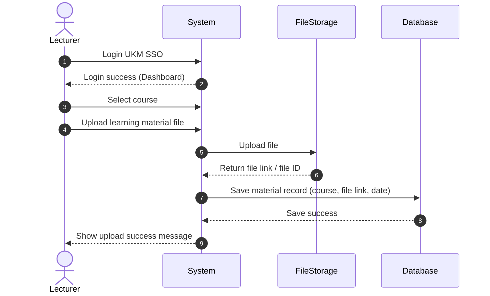

```mermaid
sequenceDiagram
autonumber
actor Lecturer
participant System
participant Storage as FileStorage
participant DB as Database

Lecturer->>System: Login UKM SSO
System-->>Lecturer: Login success (Dashboard)

Lecturer->>System: Select course
Lecturer->>System: Upload learning material file
System->>Storage: Upload file
Storage-->>System: Return file link / file ID

System->>DB: Save material record (course, file link, date)
DB-->>System: Save success
System-->>Lecturer: Show upload success message

```