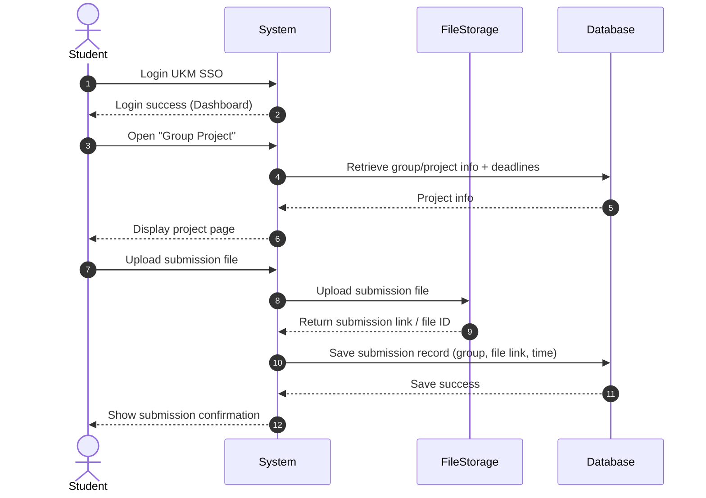

```mermaid
sequenceDiagram
autonumber
actor Student
participant System
participant Storage as FileStorage
participant DB as Database

Student->>System: Login UKM SSO
System-->>Student: Login success (Dashboard)

Student->>System: Open "Group Project"
System->>DB: Retrieve group/project info + deadlines
DB-->>System: Project info
System-->>Student: Display project page

Student->>System: Upload submission file
System->>Storage: Upload submission file
Storage-->>System: Return submission link / file ID

System->>DB: Save submission record (group, file link, time)
DB-->>System: Save success
System-->>Student: Show submission confirmation

```