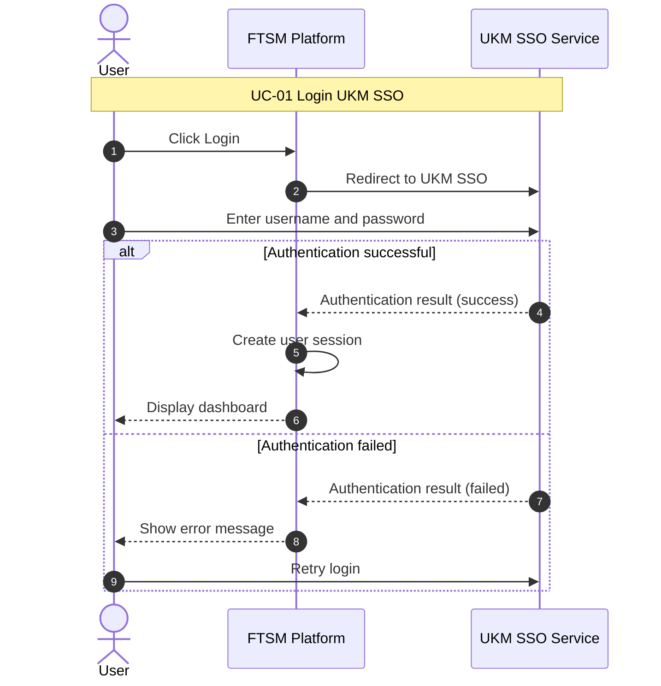

```mermaid
sequenceDiagram
autonumber
actor User
participant System as FTSM Platform
participant SSO as UKM SSO Service

Note over User,SSO: UC-01 Login UKM SSO
User->>System: Click Login
System->>SSO: Redirect to UKM SSO
User->>SSO: Enter username and password

alt Authentication successful
SSO-->>System: Authentication result (success)
System->>System: Create user session
System-->>User: Display dashboard
else Authentication failed
SSO-->>System: Authentication result (failed)
System-->>User: Show error message
User->>SSO: Retry login
end

```