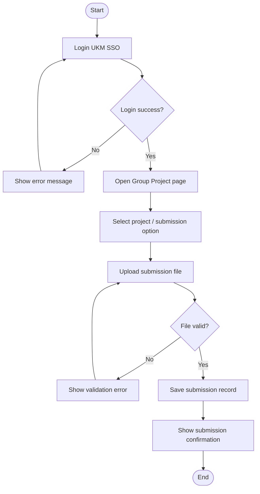

```mermaid
flowchart TD
A([Start]) --> B[Login UKM SSO]
B --> C{Login success?}
C -- No --> D[Show error message]
D --> B

C -- Yes --> E[Open Group Project page]
E --> F[Select project / submission option]
F --> G[Upload submission file]
G --> H{File valid?}
H -- No --> I[Show validation error]
I --> G

H -- Yes --> J[Save submission record]
J --> K[Show submission confirmation]
K --> L([End])
```