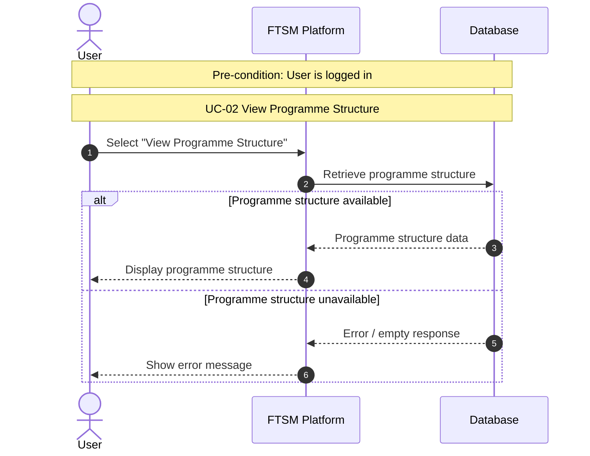

```mermaid
sequenceDiagram
autonumber
actor User
participant System as FTSM Platform
participant DB as Database

Note over User,DB: Pre-condition: User is logged in
Note over User,DB: UC-02 View Programme Structure

User->>System: Select "View Programme Structure"
System->>DB: Retrieve programme structure

alt Programme structure available
DB-->>System: Programme structure data
System-->>User: Display programme structure
else Programme structure unavailable
DB-->>System: Error / empty response
System-->>User: Show error message
end

```