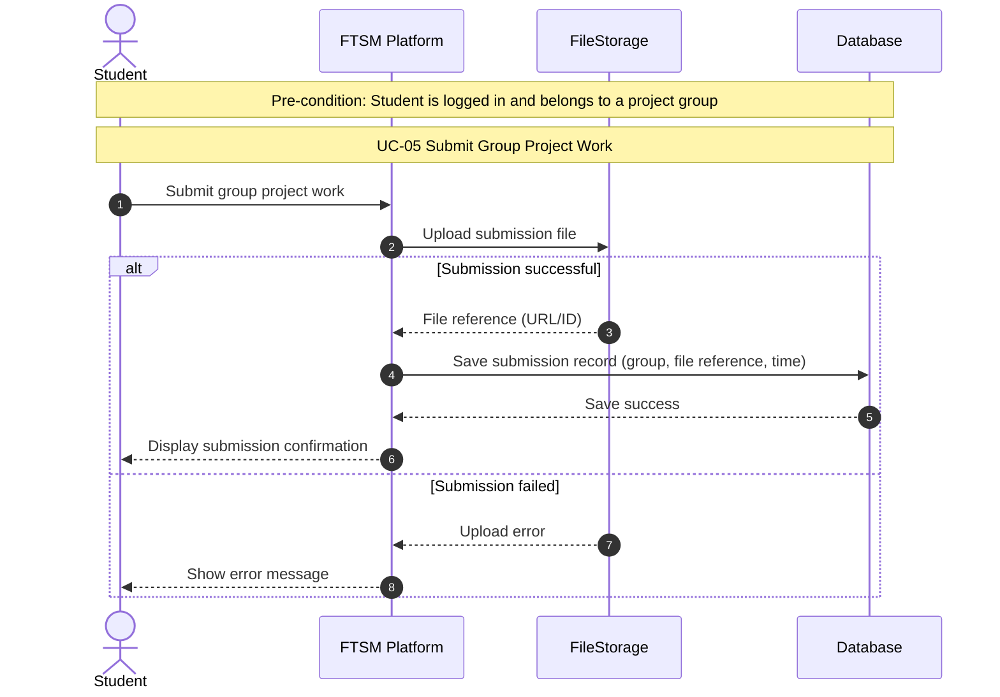

```mermaid
sequenceDiagram
autonumber
actor Student
participant System as FTSM Platform
participant Storage as FileStorage
participant DB as Database

Note over Student,DB: Pre-condition: Student is logged in and belongs to a project group
Note over Student,DB: UC-05 Submit Group Project Work

Student->>System: Submit group project work
System->>Storage: Upload submission file

alt Submission successful
Storage-->>System: File reference (URL/ID)
System->>DB: Save submission record (group, file reference, time)
DB-->>System: Save success
System-->>Student: Display submission confirmation
else Submission failed
Storage-->>System: Upload error
System-->>Student: Show error message
end

```