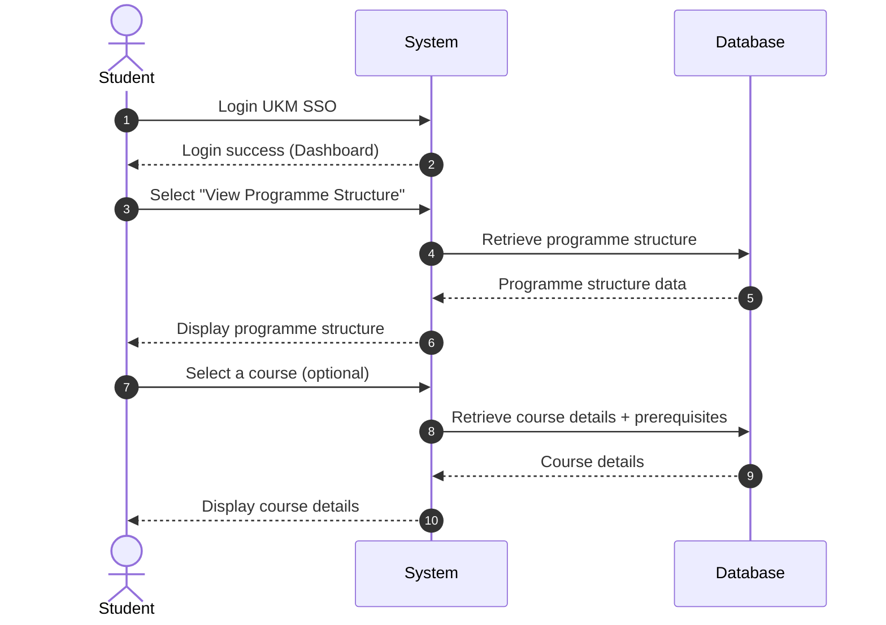

```mermaid
sequenceDiagram
autonumber
actor Student
participant System
participant DB as Database

Student->>System: Login UKM SSO
System-->>Student: Login success (Dashboard)

Student->>System: Select "View Programme Structure"
System->>DB: Retrieve programme structure
DB-->>System: Programme structure data
System-->>Student: Display programme structure

Student->>System: Select a course (optional)
System->>DB: Retrieve course details + prerequisites
DB-->>System: Course details
System-->>Student: Display course details

```