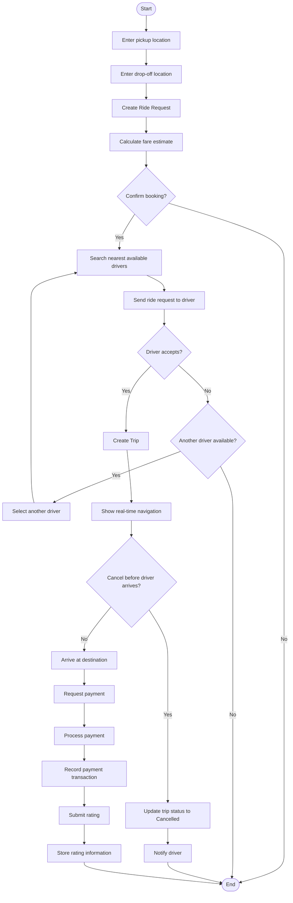

```mermaid
flowchart TD
    Start([Start])
    End([End])

    A[Enter pickup location]
    B[Enter drop-off location]
    C[Create Ride Request]
    D[Calculate fare estimate]
    E{Confirm booking?}

    F[Search nearest available drivers]
    G[Send ride request to driver]
    H{Driver accepts?}

    I[Select another driver]
    J{Another driver available?}

    K[Create Trip]
    L[Show real-time navigation]

    M{Cancel before driver arrives?}
    N[Update trip status to Cancelled]
    O[Notify driver]

    P[Arrive at destination]
    Q[Request payment]
    R[Process payment]
    S[Record payment transaction]

    T[Submit rating]
    U[Store rating information]

    %% Flow
    Start --> A --> B --> C --> D --> E

    E -- No --> End
    E -- Yes --> F --> G --> H

    H -- No --> J
    J -- Yes --> I --> F
    J -- No --> End

    H -- Yes --> K --> L --> M

    M -- Yes --> N --> O --> End
    M -- No --> P --> Q --> R --> S --> T --> U --> End

```