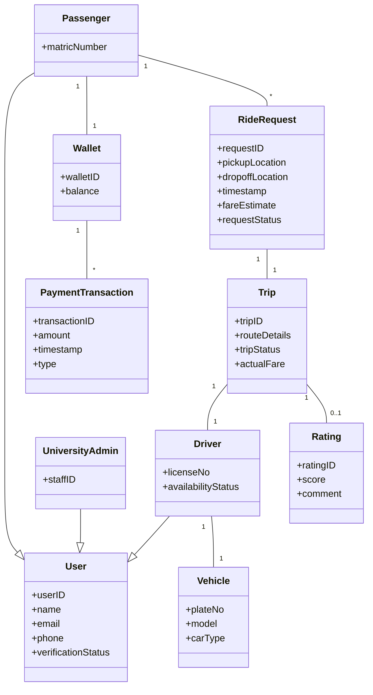

```mermaid
classDiagram

class User {
  +userID
  +name
  +email
  +phone
  +verificationStatus
}

class Passenger {
  +matricNumber
}

class Driver {
  +licenseNo
  +availabilityStatus
}

class UniversityAdmin {
  +staffID
}

class Vehicle {
  +plateNo
  +model
  +carType
}

class RideRequest {
  +requestID
  +pickupLocation
  +dropoffLocation
  +timestamp
  +fareEstimate
  +requestStatus
}

class Trip {
  +tripID
  +routeDetails
  +tripStatus
  +actualFare
}

class Wallet {
  +walletID
  +balance
}

class PaymentTransaction {
  +transactionID
  +amount
  +timestamp
  +type
}

class Rating {
  +ratingID
  +score
  +comment
}

Passenger --|> User
Driver --|> User
UniversityAdmin --|> User

Driver "1" -- "1" Vehicle
Passenger "1" -- "1" Wallet
Passenger "1" -- "*" RideRequest
RideRequest "1" -- "1" Trip
Trip "1" -- "1" Driver
Trip "1" -- "0..1" Rating
Wallet "1" -- "*" PaymentTransaction

```