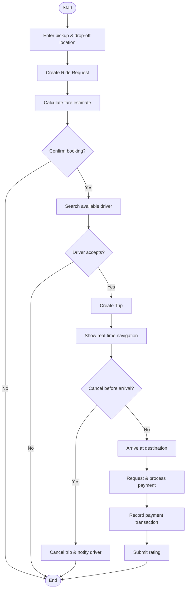

```mermaid
flowchart TD
    Start([Start])

    A[Enter pickup & drop-off location]
    B[Create Ride Request]
    C[Calculate fare estimate]
    D{Confirm booking?}

    E[Search available driver]
    F{Driver accepts?}

    G[Create Trip]
    H[Show real-time navigation]

    I{Cancel before arrival?}
    J[Cancel trip & notify driver]

    K[Arrive at destination]
    L[Request & process payment]
    M[Record payment transaction]
    N[Submit rating]

    End([End])

    Start --> A --> B --> C --> D
    D -- No --> End
    D -- Yes --> E --> F

    F -- No --> End
    F -- Yes --> G --> H --> I

    I -- Yes --> J --> End
    I -- No --> K --> L --> M --> N --> End
```