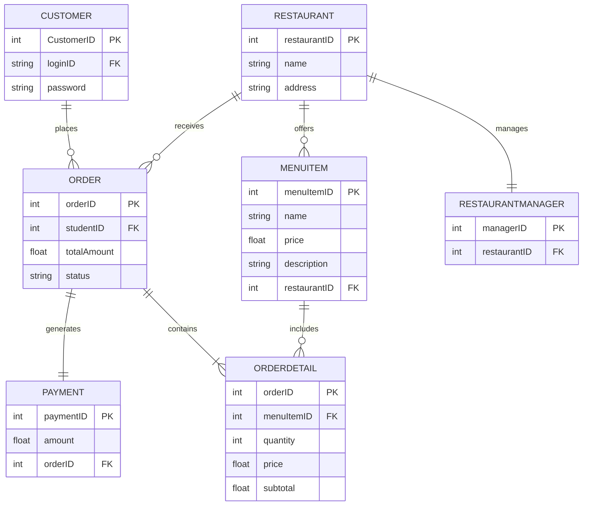

```mermaid
erDiagram

    CUSTOMER {
        int CustomerID PK
        string loginID FK
        string password
    }

    RESTAURANT {
        int restaurantID PK
        string name
        string address
    }

    MENUITEM {
        int menuItemID PK
        string name
        float price
        string description
        int restaurantID FK
    }

    ORDER {
        int orderID PK
        int studentID FK
        float totalAmount
        string status
    }

    ORDERDETAIL {
        int orderID PK
        int menuItemID FK
        int quantity
        float price
        float subtotal
    }

    PAYMENT {
        int paymentID PK
        float amount
        int orderID FK
    }

    RESTAURANTMANAGER {
        int managerID PK
        int restaurantID FK
    }

    %% Relationships
    CUSTOMER ||--o{ ORDER : places
    ORDER ||--|{ ORDERDETAIL : contains
    MENUITEM ||--o{ ORDERDETAIL : includes
    RESTAURANT ||--o{ MENUITEM : offers
    RESTAURANT ||--|| RESTAURANTMANAGER : manages
    ORDER ||--|| PAYMENT : generates
    RESTAURANT ||--o{ ORDER : receives

```