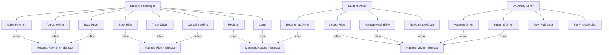

```mermaid
graph TD
  %% Actors
  P[Student Passenger]
  D[Student Driver]
  A[University Admin]

  %% Abstract Use Cases
  AC[Manage Account - abstract]
  AR[Manage Ride - abstract]
  AP[Process Payment - abstract]
  AD[Manage Driver - abstract]

  %% Passenger Concrete Use Cases
  P --> R1[Register]
  P --> L1[Login]
  P --> B1[Book Ride]
  P --> T1[Track Driver]
  P --> C1[Cancel Booking]
  P --> M1[Make Payment]
  P --> W1[Top-up Wallet]
  P --> S1[Rate Driver]

  %% Driver Concrete Use Cases
  D --> DR1[Register as Driver]
  D --> A1[Accept Ride]
  D --> AV1[Manage Availability]
  D --> N1[Navigate to Pickup]

  %% Admin Concrete Use Cases
  A --> AD1[Approve Driver]
  A --> SD1[Suspend Driver]
  A --> VL1[View Ride Logs]
  A --> PR1[Set Pricing Rules]

  %% Refinement (Concrete -> Abstract)
  R1 -->|refine| AC
  L1 -->|refine| AC
  DR1 -->|refine| AC

  B1 -->|refine| AR
  T1 -->|refine| AR
  C1 -->|refine| AR

  M1 -->|refine| AP
  W1 -->|refine| AP
  S1 -->|refine| AP

  A1 -->|refine| AD
  AV1 -->|refine| AD
  N1 -->|refine| AD
  AD1 -->|refine| AD
  SD1 -->|refine| AD

```