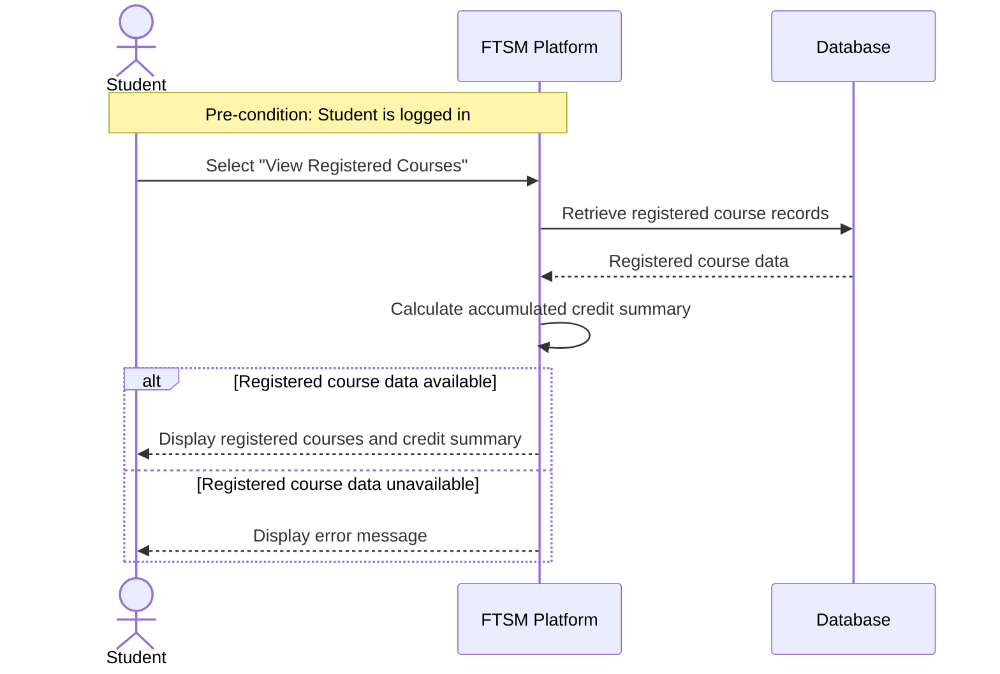

```mermaid
sequenceDiagram
    actor Student
    participant System as FTSM Platform
    participant DB as Database

    Note over Student,System: Pre-condition: Student is logged in

    Student->>System: Select "View Registered Courses"
    System->>DB: Retrieve registered course records
    DB-->>System: Registered course data

    System->>System: Calculate accumulated credit summary

    alt Registered course data available
        System-->>Student: Display registered courses and credit summary
    else Registered course data unavailable
        System-->>Student: Display error message
    end
```