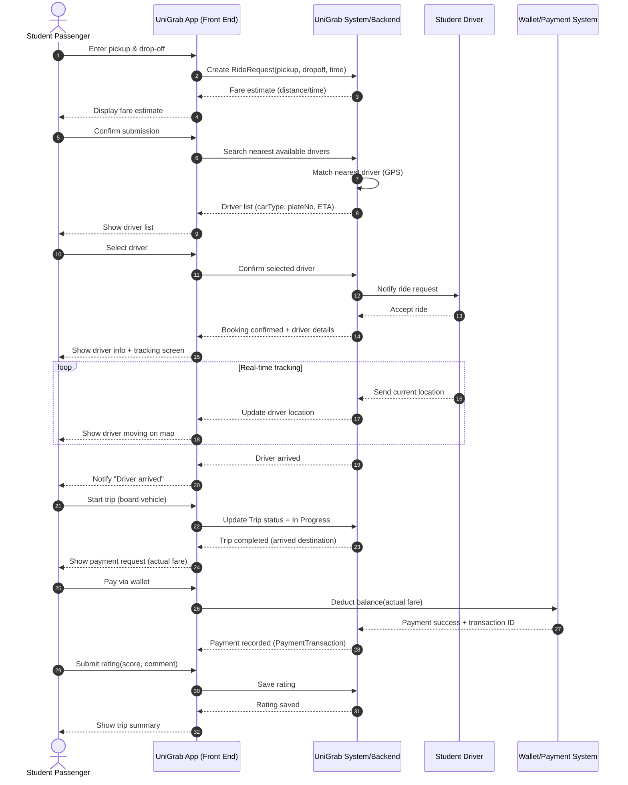

```mermaid
sequenceDiagram
  autonumber
  actor P as Student Passenger
  participant App as UniGrab App (Front End)
  participant S as UniGrab System/Backend
  participant D as Student Driver
  participant W as Wallet/Payment System

  %% Main Flow
  P->>App: Enter pickup & drop-off
  App->>S: Create RideRequest(pickup, dropoff, time)
  S-->>App: Fare estimate (distance/time)
  App-->>P: Display fare estimate

  P->>App: Confirm submission
  App->>S: Search nearest available drivers
  S->>S: Match nearest driver (GPS)
  S-->>App: Driver list (carType, plateNo, ETA)
  App-->>P: Show driver list

  P->>App: Select driver
  App->>S: Confirm selected driver
  S->>D: Notify ride request
  D-->>S: Accept ride
  S-->>App: Booking confirmed + driver details
  App-->>P: Show driver info + tracking screen

  loop Real-time tracking
    D-->>S: Send current location
    S-->>App: Update driver location
    App-->>P: Show driver moving on map
  end

  S-->>App: Driver arrived
  App-->>P: Notify "Driver arrived"
  P->>App: Start trip (board vehicle)
  App->>S: Update Trip status = In Progress

  S-->>App: Trip completed (arrived destination)
  App-->>P: Show payment request (actual fare)

  P->>App: Pay via wallet
  App->>W: Deduct balance(actual fare)
  W-->>S: Payment success + transaction ID
  S-->>App: Payment recorded (PaymentTransaction)

  P->>App: Submit rating(score, comment)
  App->>S: Save rating
  S-->>App: Rating saved
  App-->>P: Show trip summary

```