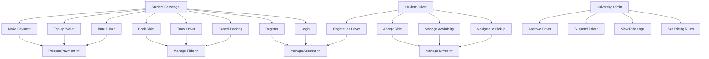

```mermaid
graph TD
  %% Actors
  Passenger[Student Passenger]
  Driver[Student Driver]
  Admin[University Admin]

  %% Abstract Use Cases
  ManageAccount[Manage Account <<abstract>>]
  ManageRide[Manage Ride <<abstract>>]
  ProcessPayment[Process Payment <<abstract>>]
  ManageDriver[Manage Driver <<abstract>>]

  %% Passenger Use Cases
  Passenger --> Register[Register]
  Passenger --> Login[Login]
  Passenger --> BookRide[Book Ride]
  Passenger --> TrackDriver[Track Driver]
  Passenger --> CancelBooking[Cancel Booking]
  Passenger --> MakePayment[Make Payment]
  Passenger --> TopUp[Top-up Wallet]
  Passenger --> RateDriver[Rate Driver]

  %% Driver Use Cases
  Driver --> RegisterDriver[Register as Driver]
  Driver --> AcceptRide[Accept Ride]
  Driver --> Availability[Manage Availability]
  Driver --> Navigate[Navigate to Pickup]

  %% Admin Use Cases
  Admin --> ApproveDriver[Approve Driver]
  Admin --> SuspendDriver[Suspend Driver]
  Admin --> ViewLogs[View Ride Logs]
  Admin --> Pricing[Set Pricing Rules]

  %% Concrete -> Abstract (Refinement)
  Register --> ManageAccount
  Login --> ManageAccount
  RegisterDriver --> ManageAccount

  BookRide --> ManageRide
  TrackDriver --> ManageRide
  CancelBooking --> ManageRide

  MakePayment --> ProcessPayment
  TopUp --> ProcessPayment
  RateDriver --> ProcessPayment

  AcceptRide --> ManageDriver
  Availability --> ManageDriver
  Navigate --> ManageDriver

```