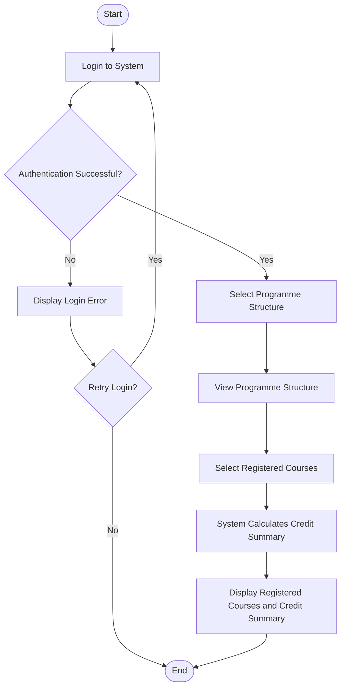

```mermaid
flowchart TD
    A([Start]) --> B[Login to System]
    B --> C{Authentication Successful?}

    C -- No --> D[Display Login Error]
    D --> E{Retry Login?}
    E -- Yes --> B
    E -- No --> Z([End])

    C -- Yes --> F[Select Programme Structure]
    F --> G[View Programme Structure]
    G --> H[Select Registered Courses]
    H --> I[System Calculates Credit Summary]
    I --> J[Display Registered Courses and Credit Summary]
    J --> Z([End])

```