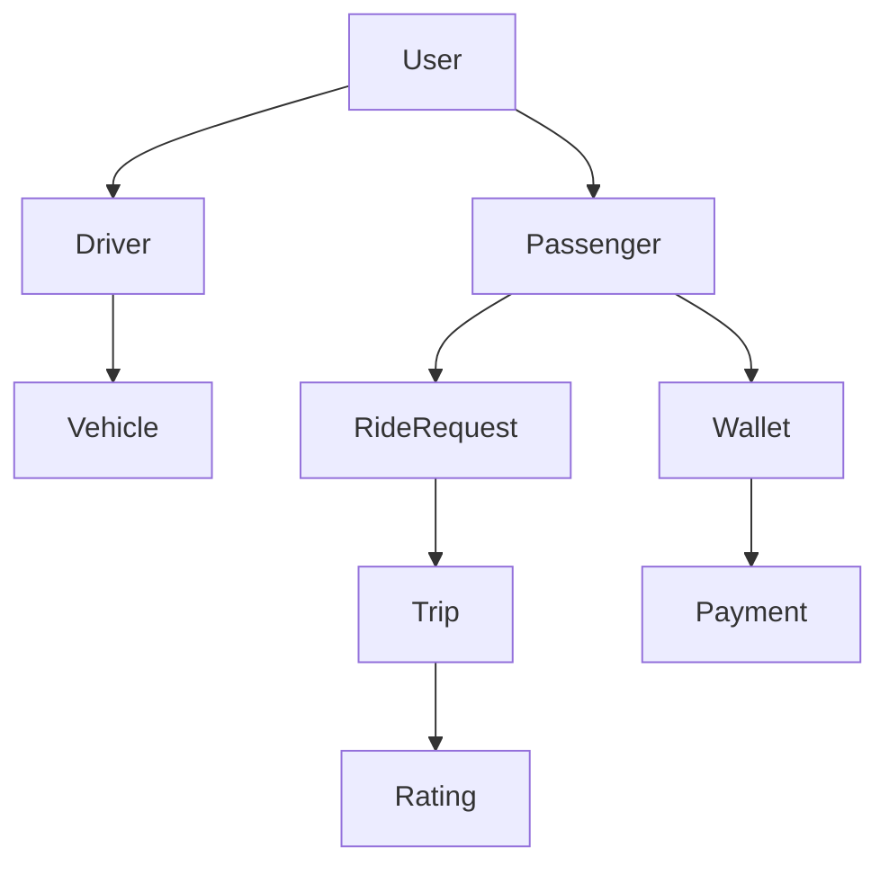

```mermaid
graph TD
  %% Classes
  User[User]
  Passenger[Passenger]
  Driver[Driver]
  Vehicle[Vehicle]
  RideRequest[RideRequest]
  Trip[Trip]
  Wallet[Wallet]
  Payment[Payment]
  Rating[Rating]

  %% Inheritance
  User --> Passenger
  User --> Driver

  %% Associations
  Driver --> Vehicle
  Passenger --> RideRequest
  RideRequest --> Trip
  Passenger --> Wallet
  Wallet --> Payment
  Trip --> Rating

```