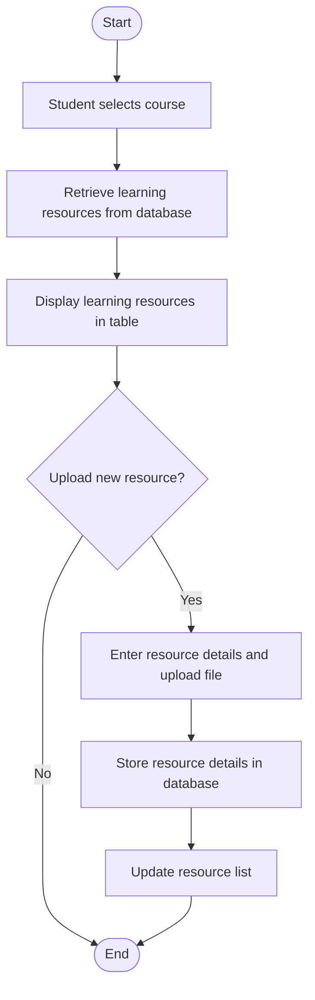

```mermaid
flowchart TD
    A([Start]) --> B[Student selects course]
    B --> C[Retrieve learning resources from database]
    C --> D[Display learning resources in table]
    D --> E{Upload new resource?}
    E -- No --> F([End])
    E -- Yes --> G[Enter resource details and upload file]
    G --> H[Store resource details in database]
    H --> I[Update resource list]
    I --> F

```