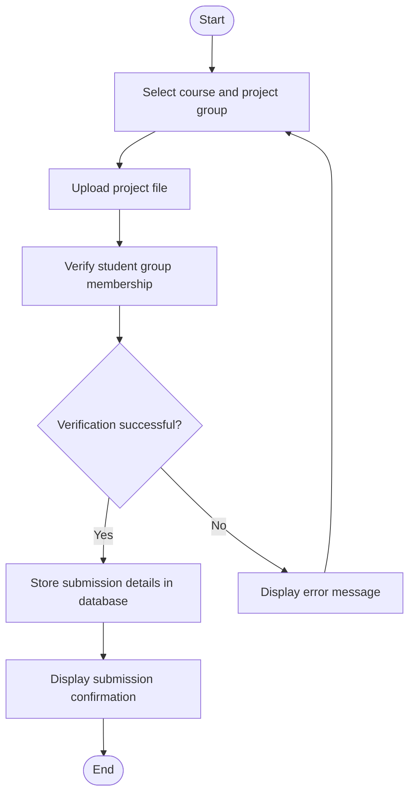

```mermaid
flowchart TD
    A([Start]) --> B[Select course and project group]
    B --> C[Upload project file]
    C --> D[Verify student group membership]
    D --> E{Verification successful?}
    E -- Yes --> F[Store submission details in database]
    F --> G[Display submission confirmation]
    G --> H([End])
    E -- No --> I[Display error message]
    I --> B

```