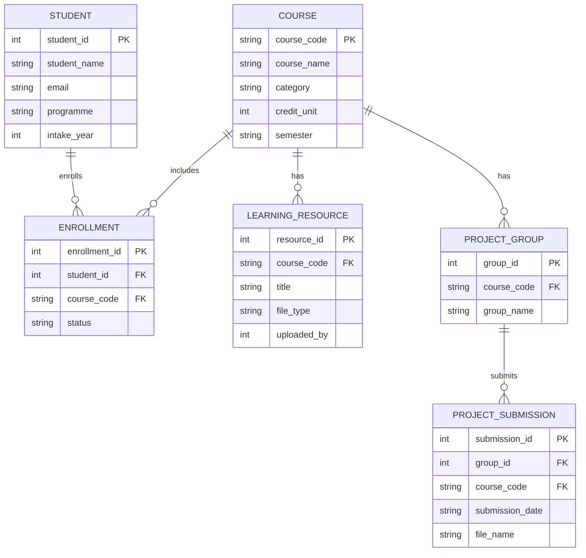

```mermaid
erDiagram
    STUDENT ||--o{ ENROLLMENT : enrolls
    COURSE  ||--o{ ENROLLMENT : includes

    COURSE  ||--o{ LEARNING_RESOURCE : has
    COURSE  ||--o{ PROJECT_GROUP : has
    PROJECT_GROUP ||--o{ PROJECT_SUBMISSION : submits

    STUDENT {
        int student_id PK
        string student_name
        string email
        string programme
        int intake_year
    }

    COURSE {
        string course_code PK
        string course_name
        string category
        int credit_unit
        string semester
    }

    ENROLLMENT {
        int enrollment_id PK
        int student_id FK
        string course_code FK
        string status
    }

    LEARNING_RESOURCE {
        int resource_id PK
        string course_code FK
        string title
        string file_type
        int uploaded_by
    }

    PROJECT_GROUP {
        int group_id PK
        string course_code FK
        string group_name
    }

    PROJECT_SUBMISSION {
        int submission_id PK
        int group_id FK
        string course_code FK
        string submission_date
        string file_name
    }

```