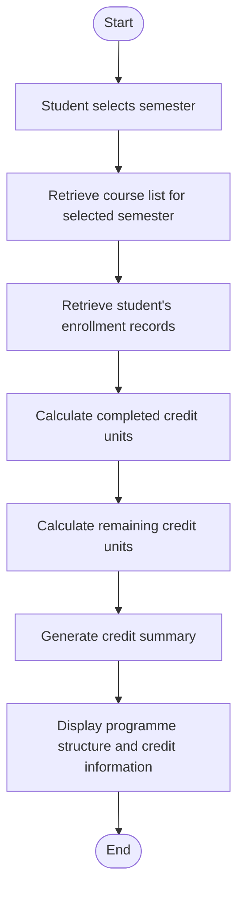

```mermaid
flowchart TD
    A([Start]) --> B[Student selects semester]
    B --> C[Retrieve course list for selected semester]
    C --> D[Retrieve student's enrollment records]
    D --> E[Calculate completed credit units]
    E --> F[Calculate remaining credit units]
    F --> G[Generate credit summary]
    G --> H[Display programme structure and credit information]
    H --> I([End])

```