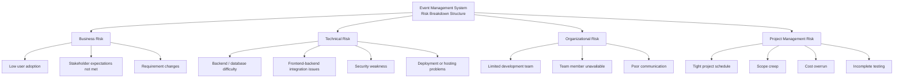

```mermaid
flowchart TB
    A["Event Management System<br/>Risk Breakdown Structure"]

    A --> B["Business Risk"]
    A --> C["Technical Risk"]
    A --> D["Organizational Risk"]
    A --> E["Project Management Risk"]

    B --> B1["Low user adoption"]
    B --> B2["Stakeholder expectations not met"]
    B --> B3["Requirement changes"]

    C --> C1["Backend / database difficulty"]
    C --> C2["Frontend-backend integration issues"]
    C --> C3["Security weakness"]
    C --> C4["Deployment or hosting problems"]

    D --> D1["Limited development team"]
    D --> D2["Team member unavailable"]
    D --> D3["Poor communication"]

    E --> E1["Tight project schedule"]
    E --> E2["Scope creep"]
    E --> E3["Cost overrun"]
    E --> E4["Incomplete testing"]
```