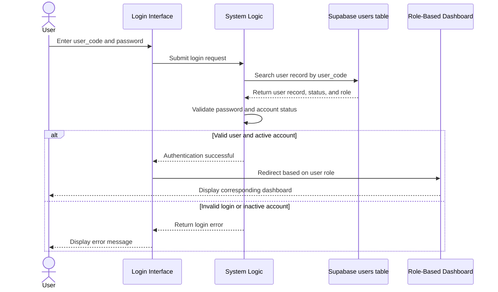

```mermaid
sequenceDiagram
    actor User
    participant Login as Login Interface
    participant System as System Logic
    participant Users as Supabase users table
    participant Dashboard as Role-Based Dashboard

    User->>Login: Enter user_code and password
    Login->>System: Submit login request
    System->>Users: Search user record by user_code
    Users-->>System: Return user record, status, and role
    System->>System: Validate password and account status

    alt Valid user and active account
        System-->>Login: Authentication successful
        Login->>Dashboard: Redirect based on user role
        Dashboard-->>User: Display corresponding dashboard
    else Invalid login or inactive account
        System-->>Login: Return login error
        Login-->>User: Display error message
    end
```